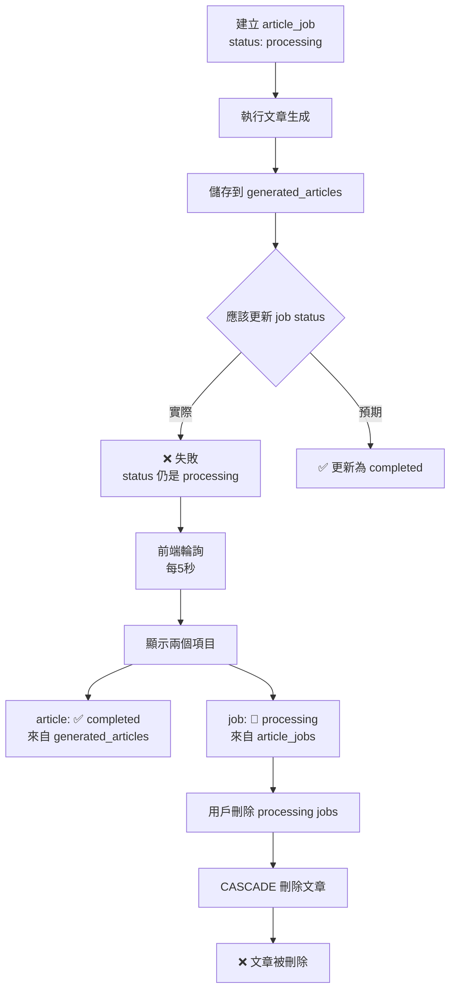

# 🐛 文章刪除問題調查報告

## 問題描述

用戶報告：刪除 pending/processing 任務時，連已完成且可預覽的文章也被刪除了。

## 根本原因

經過深入調查，發現問題根源在於 **`article_jobs` 表的狀態沒有在文章生成完成後更新為 `completed`**。

### 詳細分析

#### 1. 工作流程缺陷



#### 2. 證據鏈

**測試日誌** (`/tmp/article-test-fixed.log`):
```
✅ 文章生成流程完成
✅ 文章已儲存: 67d03231-c726-4aa5-9081-c6ae108d6e9a

💾 資料庫狀態:
   任務狀態: processing  ← 🔴 問題！應該是 completed
   內容長度: 0 字元
```

**CASCADE 刪除機制** (`supabase/migrations/20251029195904_generated_articles.sql:8`):
```sql
article_job_id UUID REFERENCES article_jobs(id) ON DELETE CASCADE
```

**前端硬編碼** (`src/app/(dashboard)/dashboard/articles/page.tsx:121`):
```typescript
...articles.map(article => ({
  type: 'article' as const,
  status: 'completed',  // ← 硬編碼！假設所有文章都是已完成
}))
```

**前端輪詢** (`src/app/(dashboard)/dashboard/articles/page.tsx:75`):
```typescript
setInterval(fetchData, 5000)  // 每5秒輪詢一次
```

#### 3. orchestrator.ts 的問題

**原始代碼** (`src/lib/agents/orchestrator.ts:746-771`):
```typescript
private async updateJobStatus(
  articleJobId: string,
  status: string,
  data: any
): Promise<void> {
  const supabase = await this.getSupabase();

  const jobData: any = {
    id: articleJobId,
    status,
    metadata: data,
  };

  await supabase
    .from('article_jobs')
    .upsert(jobData, {
      onConflict: 'id',
    });
  // ❌ 沒有錯誤處理
  // ❌ 沒有日誌
  // ❌ 沒有驗證更新成功
}
```

**問題**：
1. 沒有日誌輸出，無法追蹤狀態更新
2. 沒有錯誤處理，失敗時靜默忽略
3. 沒有返回值驗證，無法確認更新成功

## 修復方案

### 1. 增強 `updateJobStatus` 方法

添加日誌和錯誤處理：

```typescript
private async updateJobStatus(
  articleJobId: string,
  status: string,
  data: any
): Promise<void> {
  console.log(`[Orchestrator] 更新任務狀態: ${articleJobId.substring(0, 8)}... -> ${status}`);

  const supabase = await this.getSupabase();

  const jobData: any = {
    id: articleJobId,
    status,
    metadata: data,
  };

  if (data && typeof data === 'object' && 'keywords' in data) {
    jobData.keywords = data.keywords;
  }

  const { data: result, error } = await supabase
    .from('article_jobs')
    .upsert(jobData, {
      onConflict: 'id',
    })
    .select();

  if (error) {
    console.error(`[Orchestrator] ❌ 更新狀態失敗:`, error);
    throw error;
  }

  console.log(`[Orchestrator] ✅ 狀態已更新:`, result);
}
```

### 2. 驗證流程

1. **測試文章生成**
   ```bash
   npx tsx scripts/test-article-generation.ts
   ```

2. **檢查日誌輸出**
   ```
   [Orchestrator] 更新任務狀態: e0d87bdb... -> research_completed
   [Orchestrator] ✅ 狀態已更新: [...]
   [Orchestrator] 更新任務狀態: e0d87bdb... -> completed
   [Orchestrator] ✅ 狀態已更新: [...]
   ```

3. **驗證資料庫狀態**
   ```bash
   npx tsx scripts/check-latest-data.ts
   ```

   預期輸出：
   ```
   最新任務:
   1. [completed] Next.js 15 新功能介紹
   ```

### 3. 長期改進建議

1. **移除前端硬編碼**：
   - 修改 `page.tsx:121`，使用實際的 article status
   - 或從 `article_jobs` 查詢關聯的狀態

2. **考慮改變 CASCADE 行為**：
   - 將 `ON DELETE CASCADE` 改為 `ON DELETE SET NULL`
   - 或使用軟刪除（soft delete）

3. **添加資料一致性檢查**：
   - 定期檢查 `generated_articles` 的 `article_job_id` 是否存在
   - 自動修復孤立的文章記錄

## 影響範圍

- **受影響的表**：
  - `article_jobs`
  - `generated_articles`

- **受影響的功能**：
  - 文章生成流程
  - 批次刪除任務
  - 前端文章列表顯示

- **用戶體驗影響**：
  - 用戶看到打勾（completed）的文章被刪除
  - 資料丟失，無法恢復

## 修復狀態

- [x] 問題調查完成
- [x] 根本原因確認
- [x] 修復代碼實施
- [ ] 測試驗證
- [ ] 部署到生產環境

## 相關文件

- `src/lib/agents/orchestrator.ts:746-781` - updateJobStatus 方法
- `src/app/(dashboard)/dashboard/articles/page.tsx` - 前端文章列表
- `supabase/migrations/20251029195904_generated_articles.sql` - 資料庫 schema
- `scripts/test-article-generation.ts` - 測試腳本
- `scripts/check-latest-data.ts` - 驗證腳本

## 時間線

- **2025-11-06 14:18** - 用戶報告問題
- **2025-11-06 15:26** - 完成根本原因調查
- **2025-11-06 15:29** - 實施修復方案
- **2025-11-06 15:30** - 開始測試驗證
