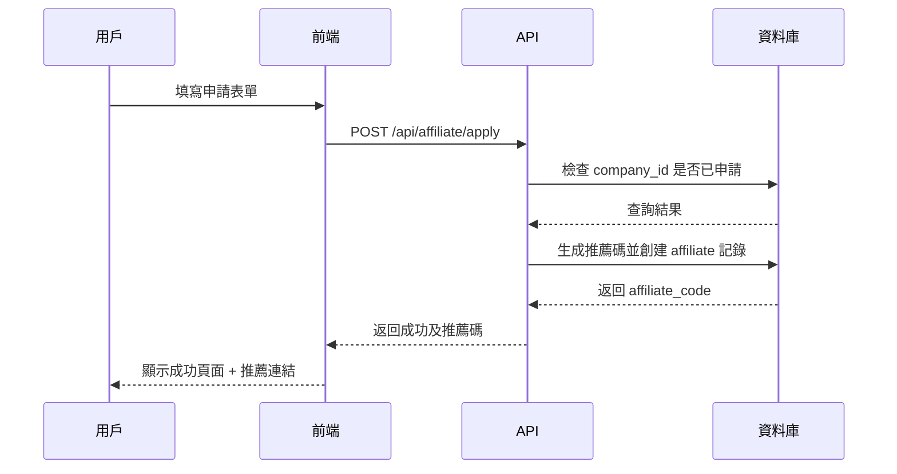
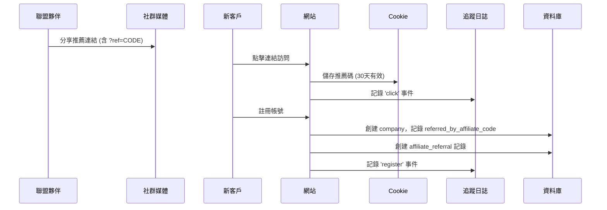
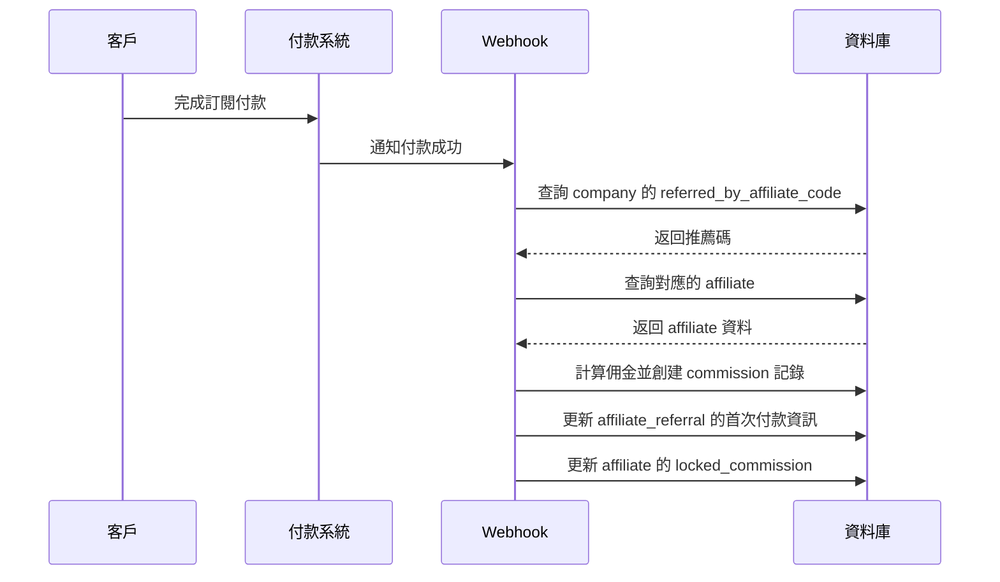
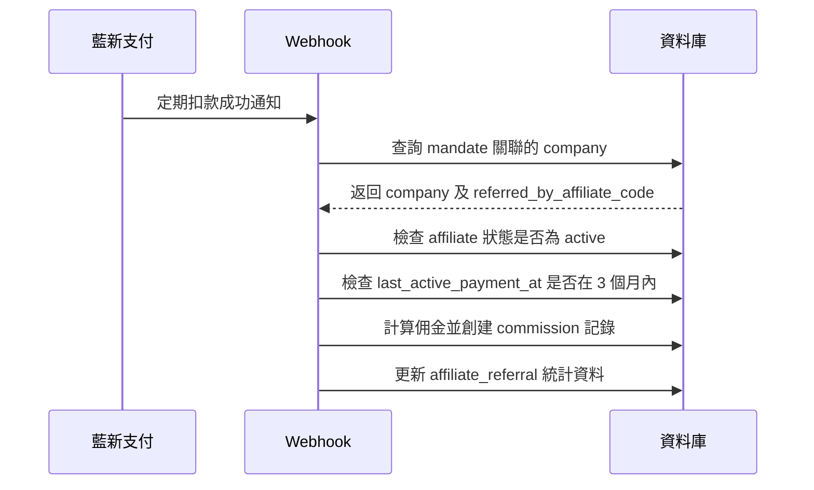
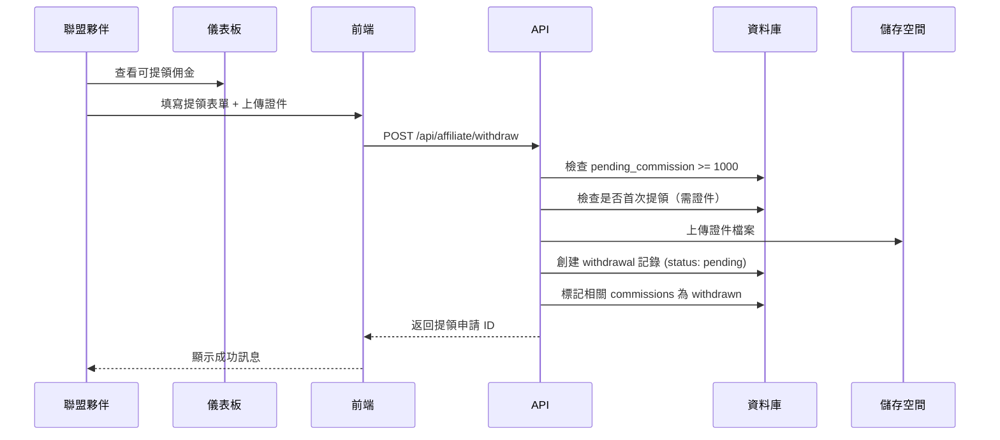
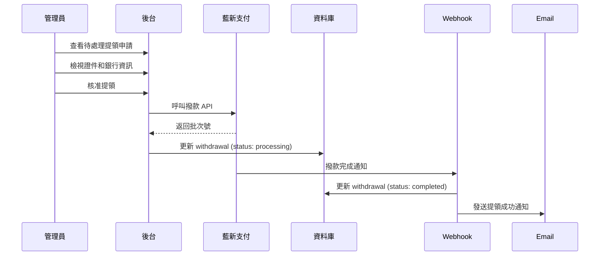

# 聯盟行銷系統設計文件

## 📌 專案概述

本系統為 Auto-pilot-SEO 平台的聯盟行銷（Affiliate Marketing）功能，允許用戶推薦新客戶並獲得佣金。

**版本**：v1.0
**最後更新**：2025-01-15

---

## 🎯 核心需求

### 1. 佣金規則

- **統一佣金率**：20%
- **適用範圍**：僅月租費訂閱（不含 Token 代幣包）
- **分潤週期**：終身分潤
- **停止條件**：連續 3 個月無新客戶自動停止

### 2. 提領規則

- **鎖定期**：30 天（防詐欺/退款）
- **最低金額**：NT$1,000
- **審核方式**：自動審核
- **證件驗證**：首次提領需上傳身份證和銀行存摺

### 3. 稅務合規

- **境內居住者**：扣繳 10%（年度累計 > NT$20,000）
- **非境內居住者**：扣繳 20%
- **扣繳憑單**：隔年 1 月底前發放

### 4. 支付方式

- 優先整合藍新支付撥款功能
- 備用方案：手動銀行轉帳

---

## 📊 資料庫架構

### 資料表設計

#### 1. `affiliates` - 聯盟夥伴主表

```sql
欄位說明：
- affiliate_code (唯一推薦碼，8位英數)
- 基本資料（姓名、身份證、聯絡資訊）
- 銀行帳戶（代碼、分行、帳號、戶名）
- 稅務資訊（是否境內、稅率、驗證狀態）
- 證件上傳（身份證、存摺、稅務文件）
- 佣金統計（pending, locked, withdrawn, lifetime）
- 狀態管理（active, inactive, suspended, terminated）
```

**狀態說明**：

- `active`: 正常運作
- `inactive`: 3 個月無新客戶（自動設定）
- `suspended`: 管理員暫停
- `terminated`: 終止合作

#### 2. `affiliate_referrals` - 推薦記錄表

```sql
欄位說明：
- 推薦關係（affiliate_id, referred_company_id）
- 追蹤資訊（來源、IP、User-Agent）
- 轉換數據（首次付款時間、金額）
- 生命週期價值（總付款次數、LTV、累計佣金）
- 活躍狀態（最後付款時間、是否活躍）
```

#### 3. `affiliate_commissions` - 佣金記錄表

```sql
欄位說明：
- 訂單關聯（payment_order_id, mandate_id）
- 佣金計算（訂單金額、佣金率、佣金額）
- 稅務處理（稅率、稅額、實際可提領金額）
- 鎖定期管理（earned_at, unlock_at）
- 狀態（locked, available, withdrawn, cancelled）
```

**佣金狀態流程**：

```
locked (30天) → available → withdrawn
           ↓
      cancelled (退款)
```

#### 4. `affiliate_withdrawals` - 提領申請表

```sql
欄位說明：
- 提領金額（扣稅前、稅額、實際撥款）
- 銀行資訊快照（提領時的帳戶）
- 證件上傳（首次需要）
- 審核流程（pending → reviewing → approved → processing → completed）
- 撥款資訊（方式、批次號、參考號）
```

#### 5. `affiliate_tracking_logs` - 追蹤日誌表

```sql
用途：記錄點擊、訪問、註冊、付款事件
欄位：event_type, session_id, ip_address, user_agent
```

### 資料庫函數

#### `generate_affiliate_code()`

- 自動生成 8 位唯一推薦碼
- 大寫字母 + 數字組合

#### `check_inactive_affiliates()`

- 由 Cron Job 每日執行
- 檢查超過 3 個月無新付款的聯盟夥伴
- 自動設定為 `inactive` 狀態

#### `unlock_commissions()`

- 由 Cron Job 每小時執行
- 解鎖已過 30 天鎖定期的佣金
- 更新聯盟夥伴的可提領餘額

---

## 🔄 系統流程

### 流程 1：用戶申請成為聯盟夥伴



**API 端點**：`POST /api/affiliate/apply`

**請求資料**：

```typescript
{
  full_name: string;
  id_number: string;
  phone: string;
  email: string;
  address: string;
  is_resident: boolean;
  agree_terms: boolean;
}
```

**自動審核邏輯**：

- 檢查資料完整性
- 驗證 ID 格式（身份證/統編）
- 自動通過並生成推薦碼

---

### 流程 2：推薦新客戶



**技術實作**：

1. **Middleware 攔截** `?ref=CODE` 參數
2. **設定 Cookie**：`affiliate_ref=CODE`，有效期 30 天
3. **註冊時讀取** Cookie，寫入 `companies.referred_by_affiliate_code`

**Cookie 設定**：

```typescript
document.cookie = `affiliate_ref=${code}; max-age=${30 * 24 * 60 * 60}; path=/; samesite=lax`;
```

---

### 流程 3：首次付款觸發佣金



**佣金計算邏輯**：

```typescript
// 僅計算訂閱付款（排除 Token 包）
if (order.payment_type !== "subscription") {
  return; // 不計算佣金
}

const commissionAmount = order.amount * 0.2; // 20%
const taxRate = affiliate.tax_rate; // 10% 或 20%
const taxAmount = commissionAmount * (taxRate / 100);
const netCommission = commissionAmount - taxAmount;

const unlockAt = new Date(order.paid_at);
unlockAt.setDate(unlockAt.getDate() + 30); // +30天

await createCommission({
  affiliate_id: affiliate.id,
  order_amount: order.amount,
  commission_amount: commissionAmount,
  tax_amount: taxAmount,
  net_commission: netCommission,
  earned_at: order.paid_at,
  unlock_at: unlockAt,
  status: "locked",
});
```

---

### 流程 4：訂閱續約持續分潤



**3 個月無活動檢查**：

```typescript
// 在計算佣金前檢查
if (affiliate.status === "inactive") {
  // 不計算佣金
  return;
}

const threeMonthsAgo = new Date();
threeMonthsAgo.setMonth(threeMonthsAgo.getMonth() - 3);

if (affiliate.last_active_payment_at < threeMonthsAgo) {
  // 超過 3 個月無活動，設為 inactive
  await updateAffiliate(affiliate.id, { status: "inactive" });
  return;
}

// 正常計算佣金...
```

---

### 流程 5：提領申請



**首次提領驗證**：

```typescript
const isFirstWithdrawal = affiliate.documents_verified === false;

if (isFirstWithdrawal) {
  // 需要上傳：身份證、存摺、稅務文件
  if (!id_document || !bank_document) {
    throw new Error("首次提領需上傳證件");
  }

  // 上傳檔案到 Supabase Storage
  const idDocUrl = await uploadDocument(id_document);
  const bankDocUrl = await uploadDocument(bank_document);

  // 更新 affiliate
  await updateAffiliate(affiliate.id, {
    id_document_url: idDocUrl,
    bank_document_url: bankDocUrl,
    documents_verified: true,
  });
}
```

---

### 流程 6：管理員審核與撥款



**藍新支付整合**（待實作）：

```typescript
// 使用藍新支付的「金流服務 - 撥款」功能
const newebpayPayout = {
  MerchantID: process.env.NEWEBPAY_MERCHANT_ID,
  Version: "1.0",
  BankCode: withdrawal.bank_code,
  BankAccount: withdrawal.bank_account,
  BankAccountName: withdrawal.bank_account_name,
  Amount: withdrawal.net_amount,
  // ... 其他參數
};

const response = await fetch("https://ccore.newebpay.com/API/Payout", {
  method: "POST",
  body: JSON.stringify(newebpayPayout),
});
```

---

## 🖥️ 前端頁面架構

### 頁面路由

```
/dashboard/affiliate
├── /apply              # 申請成為聯盟夥伴
├── /overview           # 聯盟夥伴儀表板（首頁）
├── /referrals          # 推薦客戶列表
├── /commissions        # 佣金明細
├── /withdraw           # 提領申請
├── /settings           # 設定（更新銀行資料）
└── /help               # 幫助中心（稅務須知）

/admin/affiliate
├── /dashboard          # 管理員總覽
├── /affiliates         # 聯盟夥伴列表
├── /withdrawals        # 提領審核
└── /reports            # 報表統計
```

### 主要頁面設計

#### 1. `/dashboard/affiliate/apply` - 申請頁面

**元件**：

- 申請表單
- 條款與條件（含稅務須知）
- 提交按鈕

**欄位**：

```typescript
((-真實姓名 * -身份證字號) / 統一編號) *
  -聯絡電話 *
  -Email *
  -地址 *
  -是否為境內居住者 *
  Radio -
  同意條款 * Checkbox;
```

#### 2. `/dashboard/affiliate/overview` - 儀表板

**區塊 1：統計卡片**

```
┌─────────────┬─────────────┬─────────────┬─────────────┐
│ 可提領佣金   │ 鎖定中佣金   │ 已提領總額   │ 終身累計    │
│ NT$ 5,280   │ NT$ 1,200   │ NT$ 10,000  │ NT$ 16,480 │
└─────────────┴─────────────┴─────────────┴─────────────┘
```

**區塊 2：推薦連結**

```
┌──────────────────────────────────────────────────────┐
│ 您的專屬推薦碼：ABCD1234                               │
│ https://yoursite.com/?ref=ABCD1234                    │
│ [複製連結] [顯示 QR Code] [分享到社群]                  │
└──────────────────────────────────────────────────────┘
```

**區塊 3：推薦統計**

```
┌────────────────────────────────────────┐
│ 總推薦人數：15 人                       │
│ 活躍推薦：10 人                         │
│ 轉換率：66.7%                           │
│ 平均訂單價值：NT$ 1,500                 │
└────────────────────────────────────────┘
```

**區塊 4：最近推薦**

```
┌──────────────────────────────────────────────────────┐
│ 客戶    │ 註冊日期    │ 首次付款    │ 狀態  │ 累計佣金 │
├──────────────────────────────────────────────────────┤
│ 公司A   │ 2025-01-10 │ 2025-01-12 │ 活躍  │ NT$ 300  │
│ 公司B   │ 2025-01-08 │ 未付款      │ 待轉換│ NT$ 0    │
└──────────────────────────────────────────────────────┘
```

#### 3. `/dashboard/affiliate/withdraw` - 提領申請

**表單欄位**：

```typescript
- 提領金額* (最低 NT$1,000)
- 銀行代碼* (下拉選單)
- 分行名稱
- 銀行帳號*
- 戶名* (需與身份證相符)
- [首次提領] 身份證正反面*
- [首次提領] 銀行存摺封面*
- [首次提領] 稅務聲明書*
```

**提領試算**：

```
┌──────────────────────────────────────┐
│ 提領金額：       NT$ 5,000           │
│ 扣繳稅額 (10%)： NT$ 500             │
│ ────────────────────────────────────│
│ 實際入帳：       NT$ 4,500           │
└──────────────────────────────────────┘
```

#### 4. `/admin/affiliate/withdrawals` - 管理員審核

**列表頁**：

```
┌──────────────────────────────────────────────────────────────┐
│ ID │ 聯盟夥伴 │ 申請金額 │ 稅後金額 │ 狀態  │ 操作           │
├──────────────────────────────────────────────────────────────┤
│ #1 │ 張三    │ 5,000   │ 4,500   │ 待審核│ [檢視] [核准]  │
│ #2 │ 李四    │ 2,000   │ 1,800   │ 已核准│ [檢視] [撥款]  │
└──────────────────────────────────────────────────────────────┘
```

**詳細頁**：

- 申請人資料
- 銀行帳戶資訊
- 證件預覽（身份證、存摺）
- 佣金明細（哪些訂單產生的佣金）
- 審核操作（核准/拒絕/備註）

---

## 🔧 API 端點設計

### 聯盟夥伴端

#### `POST /api/affiliate/apply`

申請成為聯盟夥伴

**Request**:

```typescript
{
  full_name: string;
  id_number: string;
  phone: string;
  email: string;
  address: string;
  is_resident: boolean;
  agree_terms: boolean;
}
```

**Response**:

```typescript
{
  success: true,
  affiliate_code: "ABCD1234",
  message: "申請成功！您的推薦碼已生成"
}
```

---

#### `GET /api/affiliate/stats`

取得統計資料

**Response**:

```typescript
{
  totalReferrals: 15,
  activeReferrals: 10,
  pendingCommission: 5280,
  lockedCommission: 1200,
  withdrawnCommission: 10000,
  lifetimeCommission: 16480,
  conversionRate: 66.7,
  averageOrderValue: 1500,
  lastPaymentDate: "2025-01-10T10:30:00Z"
}
```

---

#### `GET /api/affiliate/referrals`

取得推薦客戶列表

**Query Params**:

- `page`: number
- `limit`: number
- `status`: 'all' | 'active' | 'inactive'

**Response**:

```typescript
{
  data: [
    {
      id: "uuid",
      company_name: "公司A",
      registered_at: "2025-01-10",
      first_payment_at: "2025-01-12",
      lifetime_value: 4500,
      total_commission_generated: 900,
      is_active: true
    }
  ],
  pagination: {
    total: 15,
    page: 1,
    limit: 10
  }
}
```

---

#### `GET /api/affiliate/commissions`

取得佣金明細

**Query Params**:

- `page`: number
- `limit`: number
- `status`: 'locked' | 'available' | 'withdrawn' | 'all'

**Response**:

```typescript
{
  data: [
    {
      id: "uuid",
      company_name: "公司A",
      order_amount: 1500,
      commission_amount: 300,
      tax_amount: 30,
      net_commission: 270,
      earned_at: "2025-01-12",
      unlock_at: "2025-02-11",
      status: "available"
    }
  ],
  summary: {
    total_locked: 1200,
    total_available: 5280,
    total_withdrawn: 10000
  }
}
```

---

#### `POST /api/affiliate/withdraw`

申請提領

**Request** (multipart/form-data):

```typescript
{
  amount: number
  bank_code: string
  bank_branch?: string
  bank_account: string
  bank_account_name: string
  id_document?: File
  bank_document?: File
  tax_document?: File
}
```

**Response**:

```typescript
{
  success: true,
  withdrawal_id: "uuid",
  estimated_days: 5,
  message: "提領申請已提交，預計 5-7 個工作天內完成審核"
}
```

---

#### `GET /api/affiliate/withdrawals`

取得提領記錄

**Response**:

```typescript
{
  data: [
    {
      id: "uuid",
      withdrawal_amount: 5000,
      tax_amount: 500,
      net_amount: 4500,
      status: "completed",
      created_at: "2025-01-10",
      completed_at: "2025-01-15",
    },
  ];
}
```

---

### 管理員端

#### `GET /api/admin/affiliate/dashboard`

管理員總覽統計

**Response**:

```typescript
{
  total_affiliates: 50,
  active_affiliates: 45,
  total_referrals: 500,
  total_commission_paid: 150000,
  pending_withdrawals: 15,
  monthly_stats: [
    { month: "2025-01", referrals: 50, commission: 15000 }
  ]
}
```

---

#### `GET /api/admin/affiliate/withdrawals`

取得提領申請列表

**Query Params**:

- `status`: 'pending' | 'approved' | 'completed' | 'all'

---

#### `PUT /api/admin/affiliate/withdrawals/:id/approve`

核准提領

**Request**:

```typescript
{
  admin_notes?: string
  payout_method: 'bank_transfer' | 'newebpay'
}
```

---

#### `PUT /api/admin/affiliate/withdrawals/:id/reject`

拒絕提領

**Request**:

```typescript
{
  rejection_reason: string;
}
```

---

#### `POST /api/admin/affiliate/withdrawals/:id/complete`

完成撥款（手動標記）

**Request**:

```typescript
{
  payout_reference: string
  admin_notes?: string
}
```

---

## 🤖 自動化任務

### Cron Jobs

#### 1. 解鎖佣金（每小時執行）

```typescript
// /api/cron/unlock-commissions
// Vercel Cron: 0 * * * *

export async function GET(request: Request) {
  // 呼叫資料庫函數
  await supabase.rpc("unlock_commissions");

  return Response.json({ success: true });
}
```

---

#### 2. 檢查不活躍聯盟夥伴（每日執行）

```typescript
// /api/cron/check-inactive-affiliates
// Vercel Cron: 0 2 * * *

export async function GET(request: Request) {
  // 呼叫資料庫函數
  await supabase.rpc("check_inactive_affiliates");

  // 發送 Email 通知不活躍的聯盟夥伴
  const inactiveAffiliates = await getInactiveAffiliates();
  for (const affiliate of inactiveAffiliates) {
    await sendInactiveNotificationEmail(affiliate);
  }

  return Response.json({ success: true });
}
```

---

#### 3. 生成月度報表（每月 1 號執行）

```typescript
// /api/cron/monthly-report
// Vercel Cron: 0 3 1 * *

export async function GET(request: Request) {
  const lastMonth = getLastMonth();

  // 生成每位聯盟夥伴的月度報表
  const affiliates = await getAllActiveAffiliates();

  for (const affiliate of affiliates) {
    const report = await generateMonthlyReport(affiliate.id, lastMonth);
    await sendMonthlyReportEmail(affiliate, report);
  }

  return Response.json({ success: true });
}
```

---

## 📧 Email 通知

### 通知類型

1. **申請成功通知**
   - 收件人：新申請的聯盟夥伴
   - 內容：推薦碼、推薦連結、使用說明

2. **首次推薦成功通知**
   - 收件人：聯盟夥伴
   - 內容：恭喜首位客戶註冊

3. **佣金解鎖通知**
   - 收件人：聯盟夥伴
   - 內容：佣金已解鎖可提領

4. **提領申請確認**
   - 收件人：聯盟夥伴
   - 內容：提領申請已收到，審核中

5. **提領完成通知**
   - 收件人：聯盟夥伴
   - 內容：款項已撥付

6. **不活躍警告**
   - 收件人：聯盟夥伴
   - 內容：3 個月無新客戶，分潤已停止

7. **月度報表**
   - 收件人：聯盟夥伴
   - 內容：上月推薦數、佣金、統計

---

## 🔒 安全性考量

### 1. 防詐欺機制

**IP 檢測**：

```typescript
// 檢查推薦者和被推薦者 IP 是否相同
if (referrer_ip === referred_ip) {
  // 記錄可疑行為
  await logSuspiciousActivity({
    type: "same_ip",
    affiliate_id,
    ip_address,
  });
}
```

**重複註冊檢測**：

```typescript
// 檢查 Email 或身份證是否重複註冊
const existingCompany = await checkDuplicateCompany(email, id_number);
if (existingCompany) {
  throw new Error("該 Email 或身份證已註冊");
}
```

**異常交易預警**：

```typescript
// 檢測短時間內大量推薦
const recentReferrals = await getRecentReferrals(affiliate_id, "24h");
if (recentReferrals.length > 10) {
  await notifyAdmin("異常推薦活動", affiliate_id);
}
```

### 2. 權限控制

**RLS 政策**：

- 聯盟夥伴只能查看自己的資料
- 管理員可查看所有資料
- 使用 Supabase RLS 實作

**API 權限驗證**：

```typescript
// 每個 API 端點都需驗證
const user = await getAuthenticatedUser(request);
if (!user) {
  return Response.json({ error: "Unauthorized" }, { status: 401 });
}

// 檢查是否為該聯盟夥伴本人
const affiliate = await getAffiliate(user.company_id);
if (!affiliate) {
  return Response.json({ error: "Forbidden" }, { status: 403 });
}
```

### 3. 資料驗證

**身份證格式驗證**：

```typescript
// 台灣身份證：1 個英文 + 9 個數字
const ID_REGEX = /^[A-Z][12]\d{8}$/;

// 統一編號：8 個數字
const COMPANY_ID_REGEX = /^\d{8}$/;
```

**銀行帳號驗證**：

```typescript
// 檢查銀行代碼是否存在
if (!BANK_CODES[bank_code]) {
  throw new Error("無效的銀行代碼");
}

// 檢查帳號格式（各銀行不同，需客製化）
```

---

## 📈 監控與報表

### 關鍵指標 (KPIs)

1. **推薦轉換率**：註冊數 / 點擊數
2. **付費轉換率**：付費數 / 註冊數
3. **平均客戶價值 (LTV)**：總收入 / 推薦客戶數
4. **聯盟夥伴活躍率**：活躍聯盟夥伴 / 總聯盟夥伴
5. **佣金支付週期**：提領申請到完成的平均天數

### 報表類型

1. **聯盟夥伴績效排行榜**
   - Top 10 推薦人數
   - Top 10 佣金收入
   - Top 10 轉換率

2. **月度財務報表**
   - 本月新增佣金
   - 本月提領金額
   - 扣繳稅額統計

3. **客戶生命週期分析**
   - 被推薦客戶的留存率
   - 訂閱取消率
   - 升級率

---

## 🚀 實作階段規劃

### Phase 1：基礎架構（2-3 天）

- [x] 資料庫 Schema 設計
- [x] TypeScript 類型定義
- [x] 稅務須知文件
- [ ] 執行資料庫 Migration
- [ ] 追蹤系統（Cookie + Middleware）

### Phase 2：聯盟夥伴功能（2-3 天）

- [ ] 申請頁面
- [ ] 儀表板頁面
- [ ] 推薦連結生成
- [ ] 佣金明細頁面
- [ ] 提領申請頁面

### Phase 3：後端邏輯（2 天）

- [ ] 佣金自動計算（Webhook）
- [ ] 不活躍檢測 (Cron Job)
- [ ] 佣金解鎖 (Cron Job)
- [ ] Email 通知系統

### Phase 4：管理員後台（1-2 天）

- [ ] 聯盟夥伴列表
- [ ] 提領審核頁面
- [ ] 報表統計頁面

### Phase 5：藍新支付整合（1-2 天）

- [ ] 研究藍新撥款 API
- [ ] 實作自動撥款
- [ ] 測試與除錯

### Phase 6：測試與上線（1 天）

- [ ] 端對端測試
- [ ] 安全性檢查
- [ ] 效能測試
- [ ] 正式上線

**總計：約 9-12 天**

---

## ✅ 待確認事項

1. **藍新支付是否支援批量撥款？**
   - 需查閱藍新支付 API 文件

2. **證件上傳儲存位置？**
   - 建議使用 Supabase Storage (Private Bucket)

3. **扣繳憑單如何生成？**
   - 需整合報表系統或使用第三方服務

4. **是否需要申請 API 限流？**
   - 防止惡意大量申請

5. **推薦碼是否可自訂？**
   - 目前設計為自動生成，可考慮允許自訂

---

## 📚 參考資料

- [台灣稅務規定](./AFFILIATE_TAX_NOTICE.md)
- [資料庫 Schema](../supabase/migrations/20250115_affiliate_system.sql)
- [TypeScript 類型](../src/types/affiliate.types.ts)
- [藍新支付 API 文件](https://www.newebpay.com/website/Page/content/download_api)

---

**最後更新**：2025-01-15
**維護者**：開發團隊
