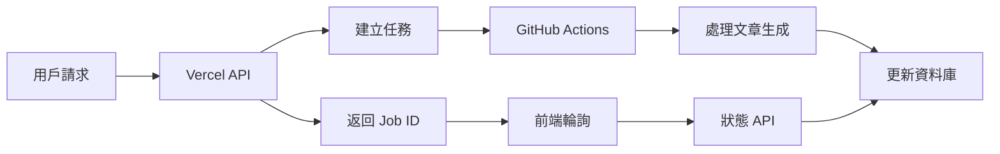

# 📚 文章生成系統完整流程文件

## 🎯 系統架構總覽

本系統使用 **Vercel + GitHub Actions** 的混合架構，解決了 Vercel 5 分鐘執行時間限制的問題，實現了長時間文章生成任務的處理。



## 🔄 完整工作流程

### 1️⃣ **文章生成請求**

**API 端點**: `POST /api/articles/generate`

```typescript
// 請求範例
{
  "title": "AI 如何改變數位行銷",
  "mode": "single",
  "targetLanguage": "zh-TW",
  "wordCount": 2000
}

// 回應範例
{
  "success": true,
  "articleJobId": "f6bfcaa1-2af0-449b-bfe8-2ecbf978bb56",
  "message": "Article generation triggered via GitHub Actions",
  "processor": "github-actions"
}
```

**處理流程**:

1. 驗證用戶身份（JWT Token 或 Cookie）
2. 檢查公司權限和網站配置
3. 建立 article_job 記錄
4. 觸發 GitHub Actions workflow
5. 立即返回 Job ID（不等待完成）

### 2️⃣ **GitHub Actions 處理**

**觸發方式**:

- API Dispatch: 立即處理單一任務
- Cron Job: 每 5 分鐘批次處理待處理任務

**執行腳本**:

- `scripts/process-single-article.js`: 處理單一文章
- `scripts/process-batch-articles.js`: 批次處理多個文章

**處理步驟**:

1. 從資料庫載入任務詳情
2. 更新狀態為 `processing`
3. 呼叫 ParallelOrchestrator 生成文章
4. 儲存文章內容到資料庫
5. 更新任務狀態為 `completed` 或 `failed`

### 3️⃣ **狀態查詢**

**API 端點**: `GET /api/articles/status?jobId={jobId}`

```typescript
// 回應範例（處理中）
{
  "status": "processing",
  "progress": 50,
  "message": "正在生成文章...",
  "startedAt": "2025-11-13T05:54:23.718Z"
}

// 回應範例（完成）
{
  "status": "completed",
  "progress": 100,
  "article": {
    "id": "article-123",
    "title": "AI 如何改變數位行銷",
    "content": "...",
    "meta_description": "..."
  },
  "completedAt": "2025-11-13T06:00:45.123Z"
}
```

## 🛠️ 技術實作細節

### 環境變數配置

```env
# Vercel 環境變數
USE_GITHUB_ACTIONS=true
GITHUB_PERSONAL_ACCESS_TOKEN=ghp_xxxxx

# Supabase 配置
NEXT_PUBLIC_SUPABASE_URL=https://xxxxx.supabase.co
NEXT_PUBLIC_SUPABASE_ANON_KEY=xxxxx
SUPABASE_SERVICE_ROLE_KEY=xxxxx

# AI 模型配置
DEEPSEEK_API_KEY=xxxxx
OPENAI_API_KEY=xxxxx
```

### GitHub Actions Workflow

`.github/workflows/article-generation.yml`:

```yaml
name: Article Generation Worker

on:
  # 手動觸發或 API 觸發
  workflow_dispatch:
    inputs:
      jobId:
        description: "Article Job ID"
        required: false

  # API 事件觸發
  repository_dispatch:
    types: [generate-article]

  # 定時批次處理
  schedule:
    - cron: "*/5 * * * *" # 每 5 分鐘

jobs:
  process-article:
    runs-on: ubuntu-latest
    timeout-minutes: 30 # 最多執行 30 分鐘

    steps:
      - uses: actions/checkout@v4
      - uses: pnpm/action-setup@v4
      - uses: actions/setup-node@v4

      - name: 安裝依賴
        run: pnpm install

      - name: 編譯 TypeScript
        run: pnpm run build:scripts

      - name: 處理文章
        run: |
          if [ "${{ github.event_name }}" = "repository_dispatch" ]; then
            node scripts/process-single-article.js \
              --jobId "${{ github.event.client_payload.jobId }}"
          else
            node scripts/process-batch-articles.js
          fi
        env:
          NEXT_PUBLIC_SUPABASE_URL: ${{ secrets.NEXT_PUBLIC_SUPABASE_URL }}
          SUPABASE_SERVICE_ROLE_KEY: ${{ secrets.SUPABASE_SERVICE_ROLE_KEY }}
          DEEPSEEK_API_KEY: ${{ secrets.DEEPSEEK_API_KEY }}
          OPENAI_API_KEY: ${{ secrets.OPENAI_API_KEY }}
```

### 資料庫架構

```sql
-- article_jobs 表
CREATE TABLE article_jobs (
  id UUID PRIMARY KEY DEFAULT uuid_generate_v4(),
  job_id TEXT UNIQUE NOT NULL,
  company_id UUID REFERENCES companies(id),
  website_id UUID REFERENCES website_configs(id),
  user_id UUID REFERENCES auth.users(id),
  keywords TEXT[],
  status TEXT CHECK (status IN ('pending', 'processing', 'completed', 'failed')),
  metadata JSONB,
  result JSONB,
  error_message TEXT,
  started_at TIMESTAMPTZ,
  completed_at TIMESTAMPTZ,
  created_at TIMESTAMPTZ DEFAULT NOW()
);

-- articles 表
CREATE TABLE articles (
  id UUID PRIMARY KEY DEFAULT uuid_generate_v4(),
  website_id UUID REFERENCES website_configs(id),
  title TEXT NOT NULL,
  content TEXT,
  meta_description TEXT,
  slug TEXT UNIQUE,
  status TEXT CHECK (status IN ('draft', 'published')),
  created_at TIMESTAMPTZ DEFAULT NOW(),
  updated_at TIMESTAMPTZ DEFAULT NOW()
);
```

## 📊 前端整合

### React 組件範例

```tsx
import { ArticleGeneratorExample } from "@/components/ArticleGeneratorExample";

export default function ArticlePage() {
  return (
    <div className="container mx-auto py-8">
      <h1 className="text-3xl font-bold mb-8">文章生成器</h1>
      <ArticleGeneratorExample />
    </div>
  );
}
```

### 輪詢機制

```typescript
// 輪詢狀態的 Hook
function useArticleStatus(jobId: string | null) {
  const [status, setStatus] = useState(null);

  useEffect(() => {
    if (!jobId) return;

    const interval = setInterval(async () => {
      const res = await fetch(`/api/articles/status?jobId=${jobId}`);
      const data = await res.json();
      setStatus(data);

      if (data.status === "completed" || data.status === "failed") {
        clearInterval(interval);
      }
    }, 5000); // 每 5 秒檢查一次

    return () => clearInterval(interval);
  }, [jobId]);

  return status;
}
```

## 🚀 測試流程

### 1. 建立測試任務

```bash
node scripts/create-test-job.js
```

### 2. 手動觸發處理

```bash
# 單一任務
node scripts/process-single-article.js --jobId YOUR_JOB_ID

# 批次處理
node scripts/process-batch-articles.js
```

### 3. 透過 API 觸發

```bash
curl -X POST https://api.github.com/repos/acejou27/Auto-pilot-SEO/dispatches \
  -H "Authorization: token YOUR_GITHUB_TOKEN" \
  -H "Accept: application/vnd.github.v3+json" \
  -d '{"event_type": "generate-article", "client_payload": {"jobId": "YOUR_JOB_ID"}}'
```

### 4. 監控執行狀態

```bash
# 查看最近的工作流程
curl -s -H "Authorization: token YOUR_GITHUB_TOKEN" \
  "https://api.github.com/repos/acejou27/Auto-pilot-SEO/actions/runs?per_page=5" \
  | jq '.workflow_runs[] | {id, status, conclusion}'
```

## ⚡ 效能優化建議

1. **並行處理**: 批次模式下最多同時處理 3 個任務
2. **超時控制**: 單一任務最多執行 30 分鐘
3. **錯誤重試**: 失敗任務會在下次批次自動重試
4. **快取機制**: 可考慮加入 Redis 快取常用資料

## 🔧 疑難排解

### 常見問題

1. **任務卡在 processing 狀態**
   - 檢查 GitHub Actions 執行日誌
   - 確認環境變數正確設定
   - 檢查 API Key 是否有效

2. **TypeScript 編譯錯誤**
   - 執行 `pnpm run build:scripts`
   - 確認 tsconfig.scripts.json 存在

3. **路徑別名解析失敗**
   - 確認 Module.\_resolveFilename 覆寫正確
   - 檢查 dist 目錄是否存在

## 📈 監控與日誌

### 查看任務狀態

```javascript
// 查詢所有任務
SELECT * FROM article_jobs
ORDER BY created_at DESC
LIMIT 10;

// 查詢失敗任務
SELECT id, job_id, error_message
FROM article_jobs
WHERE status = 'failed';
```

### GitHub Actions 日誌

前往 https://github.com/acejou27/Auto-pilot-SEO/actions 查看所有執行記錄

## 🎉 總結

這個系統成功解決了 Vercel 5 分鐘超時限制，實現了：

✅ **長時間任務處理**: 利用 GitHub Actions 30 分鐘執行時間
✅ **非同步處理**: API 立即返回，背景處理任務
✅ **自動化批次**: 每 5 分鐘自動處理待處理任務
✅ **狀態追蹤**: 即時查詢任務進度和結果
✅ **錯誤恢復**: 自動重試失敗任務

系統現已完全運作，可在生產環境使用！
