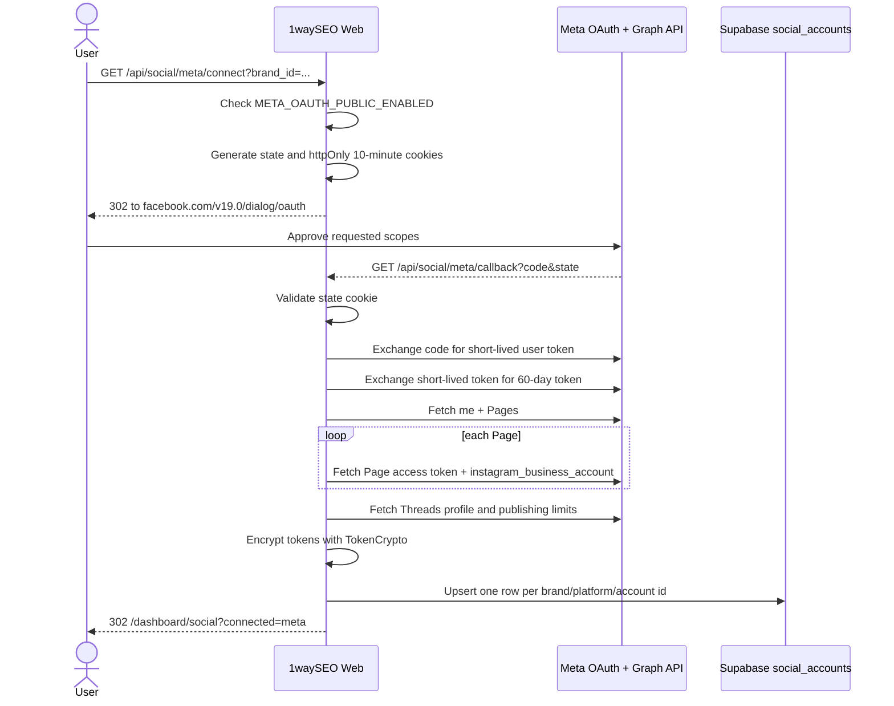

# Meta OAuth Flow Runbook

## Status

Meta OAuth is implemented behind `META_OAUTH_PUBLIC_ENABLED`. Keep it set to `false` until Meta App Review approval for issue #93 is complete. When disabled, `/api/social/meta/connect` redirects to `/dashboard/social?meta_pending_review=1`.

Required server env:

```env
META_APP_ID=op://Dev/Meta App ID/credential
META_APP_SECRET=op://Dev/Meta App Secret/credential
META_REDIRECT_URI=https://1wayseo.com/api/social/meta/callback
META_OAUTH_PUBLIC_ENABLED=false
```

## Sequence



## Token Lifecycle

The callback stores one `social_accounts` row per connected Facebook Page, Instagram Business account, and Threads profile. Tokens are encrypted with `SOCIAL_TOKEN_MASTER_KEY` through `TokenCrypto`.

Facebook Page rows store the Page-scoped token as `access_token_encrypted`. Instagram rows use the Page token associated with the Page that owns `instagram_business_account`. Threads rows use the long-lived user token returned by Meta. `refresh_token_encrypted` stores the long-lived user token source so the daily refresh can re-exchange it.

Meta long-lived user tokens expire in about 60 days. `/api/cron/meta-token-refresh` scans active Meta-family accounts where `token_expires_at` is within 7 days and calls `refreshMetaToken(accountId)`. The refresh re-exchanges the stored long-lived token and updates `access_token_encrypted`, `refresh_token_encrypted`, and `token_expires_at`.

## Requested Permissions

The OAuth authorize URL requests the issue #93 App Review scope set:

`instagram_basic`, `instagram_content_publish`, `pages_show_list`, `pages_manage_posts`, `pages_read_engagement`, `threads_basic`, `threads_content_publish`, `business_management`.

## Operations

After App Review approval:

1. Set `META_OAUTH_PUBLIC_ENABLED=true` in the platform Secret Store.
2. Set `NEXT_PUBLIC_META_OAUTH_PUBLIC_ENABLED=true` if dashboard UI needs to reveal Meta connect controls.
3. Run a tester OAuth flow and verify active `social_accounts` rows exist for expected Meta accounts.
4. Confirm `/api/cron/meta-token-refresh` returns `success: true` with the production cron secret.
